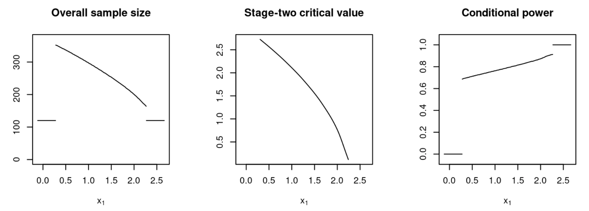

# GSOC2021_test

## Test Tasks

- Easy: Based on [1], implement an optimal adaptive trial design using existing LP solvers in R. Test it on a small size problem. 

- Medium: Add some Bayes risk constraints and increase the problem size. 

- Hard: Since the core code should be implemented in C/C++. Write a simple package implementing Matrix multiplication. The main code should use C/C++. 
References

## Test Results

- Easy: Sample code can be found in 2AED.R. The code is an implementation using adoptr package of the following optimal 2AED with a Type I error constraint:

> We consider the case of a randomized controlled clinical trial where efficacy is to be demonstrated in terms of superiority of the treatment over placebo with respect to the population mean difference $\theta$ of an outcome. Let the null hypothesis be $\mathcal{H}_0:\theta \leq 0$. Assume that the maximal type one error rate is to be controlled at a one-sided level $\lapha = 2.5\%$ and a minimal power of $90\%$ at a point alternative of $\theta_1 = 0.3$ is deemed necessary. We assume $\sigma^2 = 1$ for simplicity.

The data distribution is specified to be normal.
```{r}
datadist <- Normal(two_armed = TRUE)
```

The hypotheses and the corresponding scores (power values) are specified as
```{r}
null        <- PointMassPrior(theta = .0, mass = 1.0)
alternative <- PointMassPrior(theta = .3, mass = 1.0)
power       <- Power(dist = datadist, prior = alternative)
toer        <- Power(dist = datadist, prior = null)
```

An intial design satisfying the constraints is obtained by
```{r}
initial_design <- get_initial_design(theta = 0.3, alpha = 0.025, beta = 0.1, type = "two-stage", dist = datadist, order = 7)
```

After design optimization, a summary of the results:
> TwoStageDesign: n1 = 120 
>  
>   |        futility |                  continue                 | efficacy  |
>   |    -------------|-------------------------------------------|---------- |
>   |    x1:     0.28 |  0.33  0.54  0.87  1.27  1.68  2.01  2.22 |  2.27     |
>   |c2(x1):     +Inf | +2.70 +2.53 +2.23 +1.82 +1.31 +0.74 +0.19 |  -Inf     |
>   |n2(x1):        0 |   229   214   188   154   116    79    51 |     0     |
>   |CP(x1):     0.00 |  0.69  0.72  0.75  0.79  0.83  0.87  0.91 |  1.00     |
> 
>    Power:      0.899
>
>    ESS:    176.126

Plot of the first-stage test statistic $x_1$ versus overall sample size and the stage-two critical value.



- Hard: Sample code can be found in matrix_multiplication.c. An example of a valid matrix multiplication.

> Enter rows and columns for the first matrix: 2 3
> 
> Enter rows and columns for the second matrix: 3 2
> 
> Enter elements of the first matrix:
> 
> Enter a11: 2  
> 
> Enter a12: -3
> 
> Enter a13: 4
>
> Enter a21: 6
>
> Enter a22: 3
>
> Enter a23: 5
>
> Enter elements of the second matrix:
>
> Enter a11: 3
>
> Enter a12: 3
>
> Enter a21: 5
>
> Enter a22: 0
>
> Enter a31: -3
>
> Enter a32: 4
>
> Output Matrix:
>
> -21 22
>
> 18 38

Once the dimensions of the input matrices do not match, an error message returns

> Enter rows and columns for the first matrix: 2 3
>
> Enter rows and columns for the second matrix: 4 2
> 
> Error! Enter rows and columns again.

## References

[1] Rosenblum M, Fang E, Liu H. Optimal, two-stage, adaptive enrichment designs for randomized trials using sparse linear programming, 2017.
